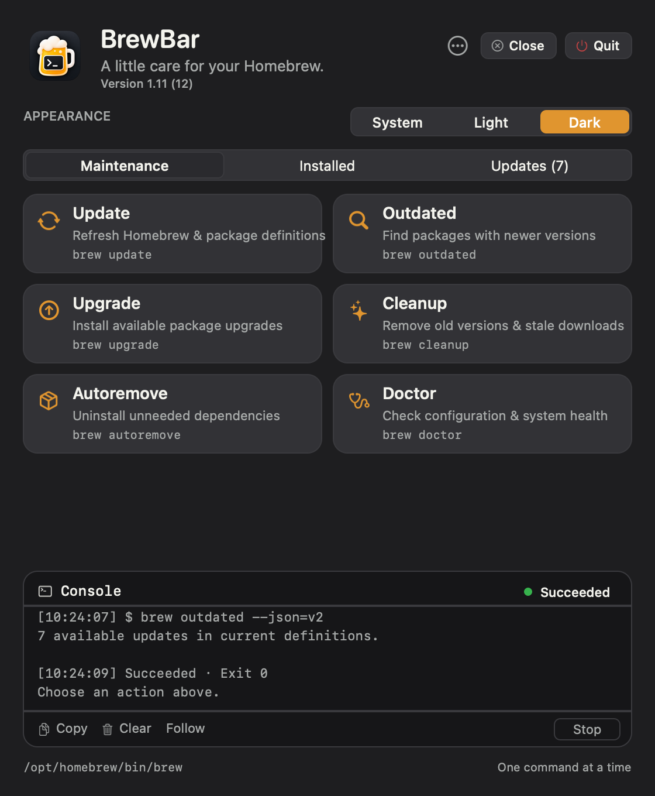
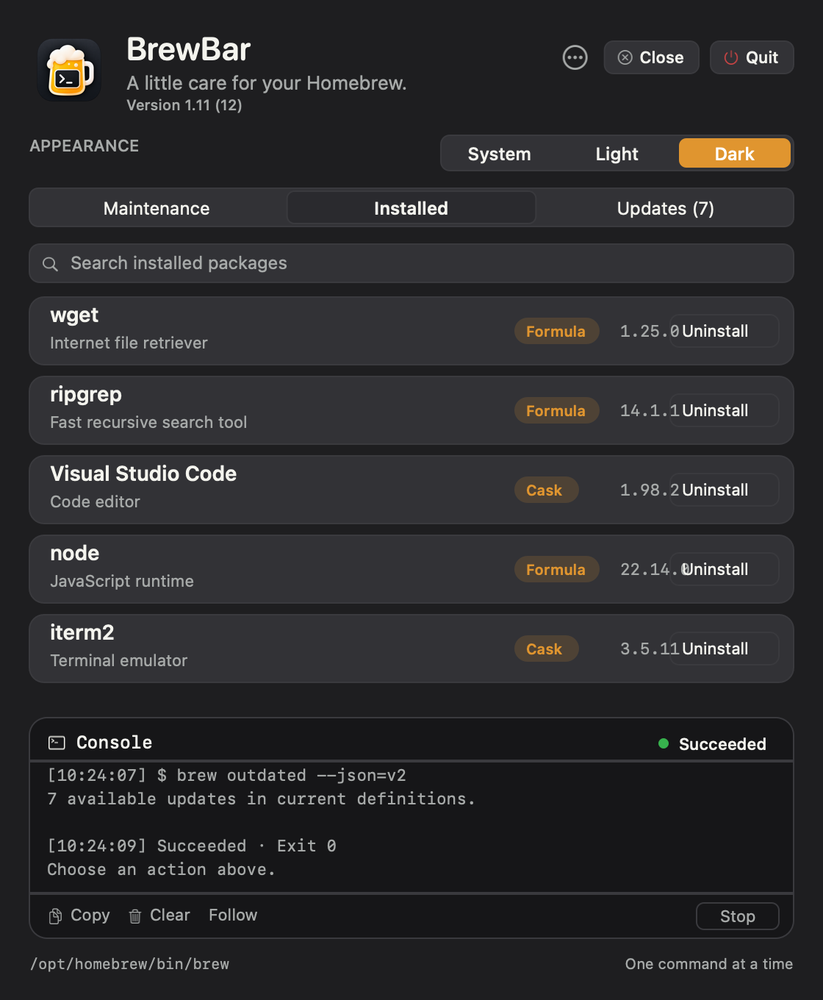
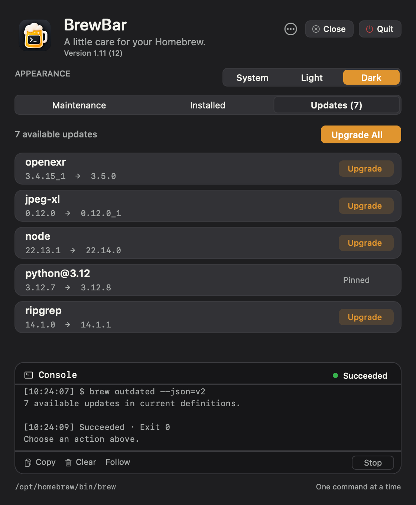

# BrewBar

A native SwiftUI menu-bar app for **Homebrew** on Apple Silicon, macOS 13 Ventura or newer. Run maintenance, browse installed packages, and manage updates from the menu bar with a live command console — no Terminal required.

**[Website & gallery](https://ahmadfaridabbas.github.io/brewbar/)** · **[Download](https://github.com/ahmadfaridabbas/brewbar/releases/latest)** · macOS 13+ · Apple Silicon

## The panel

Everything lives in one menu-bar window:

| Maintenance | Installed | Updates |
| --- | --- | --- |
|  |  |  |

- **Maintenance** — Update, Outdated, Upgrade, Cleanup, Autoremove, and Doctor, each a real `brew` command run with fixed, validated arguments.
- **Installed** — Browse installed formulae and casks with search, then uninstall with a confirmation. Homebrew's dependency checks stay active.
- **Updates** — See installed → current versions from `brew outdated`, and upgrade individually or all at once. Pinned packages are labeled.
- **Console** — Merged stdout/stderr in arrival order, timestamps, duration, and the real exit code. Stop escalates SIGINT → SIGTERM → SIGKILL.

Gallery images are native offscreen renders of BrewBar's interface, produced from its drawing code — not screen captures.

## Features

- Native SwiftUI `MenuBarExtra` panel with no Dock icon.
- System / Light / Dark appearance, saved across launches, with matching artwork.
- A visible version line and Close / Quit controls in the header. Close tucks the panel away while BrewBar stays in the menu bar; Quit is blocked while a command is running.
- Live, streaming, noninteractive console with bounded retention, Copy, Clear, and Follow.
- Locates `brew` from your login environment and shows the resolved path.

## Install

1. Download and extract [BrewBar-1.11.zip](docs/downloads/BrewBar-1.11.zip).
2. Drag `BrewBar.app` to Applications, then right-click → Open the first time.
3. Click the Terminal Mug glyph in the menu bar to open the panel.

This is a locally (ad-hoc) signed build, not Apple-notarized. macOS may ask you to approve it in Privacy & Security. BrewBar requires an existing Homebrew installation at `/opt/homebrew`.

## Publishing

See [PUBLISHING.md](PUBLISHING.md) for how the repository and website are structured and how to enable GitHub Pages.

## Status & licensing

BrewBar is an independent project and is not affiliated with or endorsed by Homebrew. It runs the `brew` binary already installed on your Mac. See [THIRD_PARTY_NOTICES.md](THIRD_PARTY_NOTICES.md).

BrewBar is released under the [MIT License](LICENSE). Copyright (c) 2026 Ahmad Farid Abbas.
